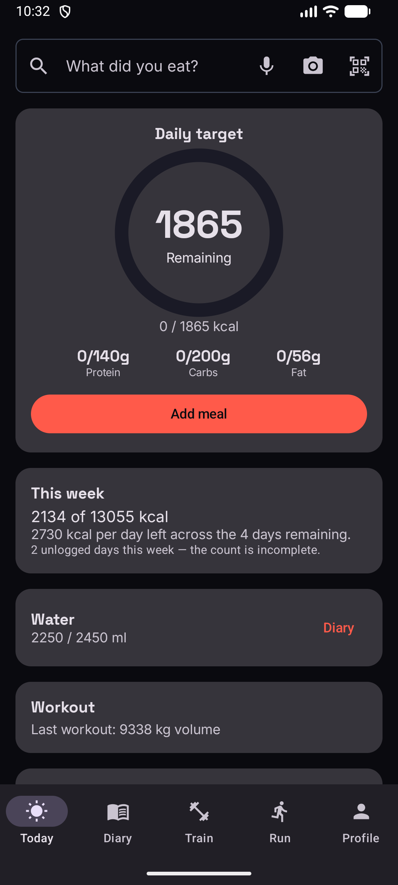
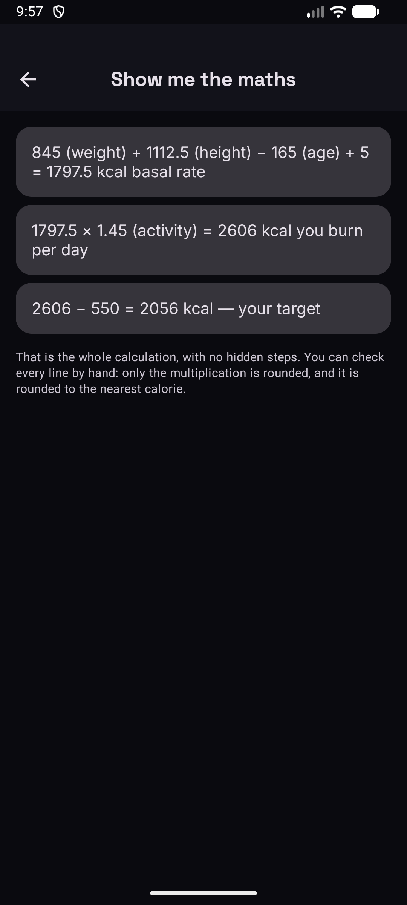
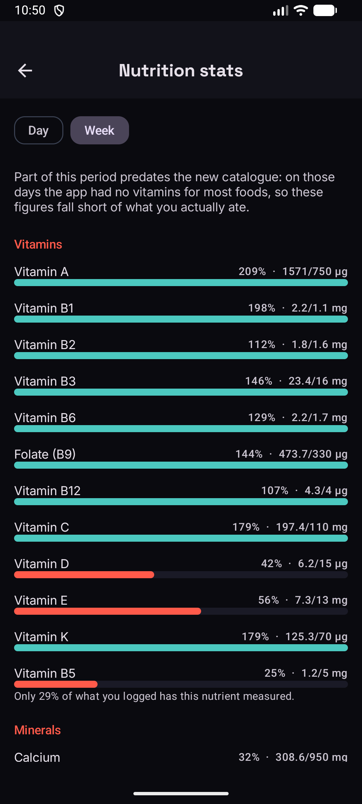

<div align="center">

# Antares

**Contador de nutrição e treino para Android, com as contas à vista.**

Regista o que comes, o que treinas e quanto pesas. Mostra-te a aritmética por trás de cada meta,
linha a linha, para poderes conferi-la à mão.


</div>

|                       Hoje                        |               Mostra-me a conta                |                    Micronutrientes                    |
| :-----------------------------------------------: | :--------------------------------------------: | :---------------------------------------------------: |
|  |  |  |

## O que a distingue

**Mostra a conta.** A meta diária não é um número que aparece: é uma soma que podes seguir.
`845 (peso) + 1112,5 (altura) − 165 (idade) + 5 = 1797,5 kcal de basal`, vezes o teu nível de
atividade, menos o teu défice. Só a multiplicação é arredondada.

**Alimentos medidos em Portugal.** 1372 alimentos da Tabela de Composição de Alimentos do INSA,
com nomes portugueses reais e micronutrientes — não traduções de uma tabela americana.

**Não há conta, nem servidor com os teus dados.** Tudo vive no telemóvel, e a app guarda sozinha
uma cópia em «Documentos/Antares» — uma pasta que fica lá mesmo que a desinstales. A app funciona
inteira em modo de avião, tirando a pesquisa em linha.

**Diz quando não sabe.** Se a semana tem dias por registar, a app diz que a conta está incompleta
em vez de fingir um número.

## Instalar

Não está em nenhuma loja. Compila-se a partir daqui, ou instala-se o APK.

## Compilar

Precisas de **JDK 17** — não 21 — e do **Android SDK 36**. Mais nada: não é preciso conta em
serviço nenhum.

```bash
git clone https://github.com/BetuelRS/Antares.git
cd Antares
./gradlew :composeApp:assembleDebug
```

O APK sai em `composeApp/build/outputs/apk/debug/`.

Para correr os testes:

```bash
./gradlew :composeApp:testDebugUnitTest
```

A análise de refeições por foto e por texto precisa de um `local.properties` com `SUPABASE_URL` e
`SUPABASE_ANON_KEY`. Sem eles a app compila e funciona; só essa funcionalidade é que não responde.

A documentação está organizada por aquilo de que precisas — [o índice está
aqui](docs/README.md).

| | |
|---|---|
| **Guias** | [compilar](docs/guias/compilar.md) · [correr os testes](docs/guias/correr-os-testes.md) · [lançar uma versão](docs/guias/lancar-uma-versao.md) · [publicar o servidor](docs/guias/publicar-o-servidor.md) |
| **Referência** | [como continuar](docs/referencia/como-continuar.md) · [base de dados](docs/referencia/base-de-dados.md) · [testes-guarda](docs/referencia/testes-guarda.md) · [versionamento](docs/referencia/versionamento.md) · [dados e licenças](docs/referencia/dados-e-licencas.md) |
| **Explicação** | [arquitetura](docs/explicacao/arquitetura.md) · [privacidade](docs/explicacao/privacidade.md) · [registo de decisões](docs/explicacao/decisoes/) |
| **Histórico** | [CHANGELOG.md](CHANGELOG.md) |

Quem quiser contribuir: [CONTRIBUTING.md](CONTRIBUTING.md). Vulnerabilidades:
[SECURITY.md](SECURITY.md).

## De onde vêm os dados

| Fonte | O que dá | Licença |
|---|---|---|
| [CIQUAL 2025 · ANSES](https://ciqual.anses.fr/) | a base do catálogo — 3329 alimentos europeus | Licence Ouverte / Etalab 2.0 |
| [USDA FoodData Central (SR Legacy)](https://fdc.nal.usda.gov/) | 2944 alimentos, e os micronutrientes que a CIQUAL não mede | domínio público (CC0) |
| [INSA — Tabela de Composição de Alimentos](https://portfir.insa.min-saude.pt/pt/) | 1372 alimentos portugueses | com direitos de autor; **uso sujeito a referenciação visível**, que a app faz no ecrã de atribuições e em cada alimento |
| [EFSA](https://www.efsa.europa.eu/) | valores de referência dos micronutrientes | dados públicos |
| [free-exercise-db](https://github.com/yuhonas/free-exercise-db) | catálogo e imagens de exercícios | Unlicense (domínio público) |
| [Open Food Facts](https://world.openfoodfacts.org/) | produtos de marca, por código de barras | ODbL; consultada em linha, nada é redistribuído |

Os importadores que preparam estes ficheiros estão em [tools/](tools/README.md).

## Estado

Projeto de uma pessoa, não publicado em loja nenhuma. Tem mais de mil testes automáticos, mas há
coisas que só um telemóvel a sério prova — o GPS, a câmara, as notificações à hora e o widget — e
essas não estão cobertas.

## Licença

[GPL-3.0](LICENSE). Podes usar, estudar, modificar e redistribuir. Se distribuíres uma versão
modificada, tens de a distribuir sob a mesma licença e disponibilizar o código.

Os dados que a app traz dentro têm licenças próprias, e a do INSA obriga a manter a referência
visível — ver [dados e licenças](docs/referencia/dados-e-licencas.md) antes de fazeres *fork*.
